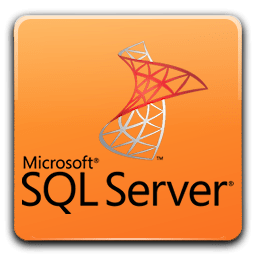

# CURSO DE SQL SERVER
👨‍⚖️SQL SERVER É UM SISTEMA DE GERENCIAMENTO DE BANCO DE DADOS RELACIONAL DESENVOLVIDO PELA MICROSOFT.

  

## CONCEITO:
O SQL Server é um sistema de gerenciamento de banco de dados relacional desenvolvido pela Microsoft. Ele oferece uma plataforma robusta para armazenamento e recuperação de dados, sendo amplamente utilizado em aplicações corporativas e de missão crítica.

## SUA HISTÓRIA:
O SQL Server foi lançado pela primeira vez em 1989 pela Sybase e, posteriormente, em parceria com a Microsoft, foi adaptado e lançado como Microsoft SQL Server em 1993. Desde então, passou por várias atualizações e versões, tornando-se um dos principais sistemas de gerenciamento de banco de dados no mercado.

## CARACTERÍSTICAS:
### POSITIVAS:
- **Escalabilidade:** Suporta desde pequenas aplicações até grandes data warehouses.
- **Segurança Avançada:** Oferece recursos robustos de segurança para proteger os dados.
- **Integração com Plataforma Microsoft:** Total integração com outras tecnologias da Microsoft como .NET, Azure, Excel, etc.
- **Suporte a BI (Business Intelligence):** Inclui ferramentas poderosas para análise de dados e geração de relatórios.

### NEGATIVAS:
- **Custo:** As licenças comerciais podem ser caras, especialmente para grandes implantações.
- **Complexidade:** Para configurações avançadas e otimização, pode exigir conhecimento especializado.
- **Limitações de Plataforma:** Alguns recursos avançados podem estar disponíveis apenas em versões específicas ou plataformas específicas (por exemplo, Azure SQL Database vs SQL Server on-premise).

## SUBSIDIOS:
- [CURSO CRIADO PELA "KAMYS ACADEMY"](https://youtube.com/playlist?list=PLLbQNZHBOJtZ1oAbve_kacS5nm9u1ULou&si=TqbcsCLHsEIVJxcc)
- [CURSO FEITO PELO VILHALVA](https://github.com/VILHALVA)
- [VEJA A DOCUMENTAÇÃO](https://learn.microsoft.com/pt-br/sql/sql-server/?view=sql-server-ver16)
- [VEJA O MANUAL](./MANUAL.md)
- [VEJA A SINTAXE](./SINTAXE.md)
- [VEJA OS PROJETOS](https://github.com/VILHALVA?tab=repositories&q=topic:SQL-SERVER)